# 🎨 HueMate — 옷 색상 조합 추천 & 조화도 분석

이미지에서 대표색을 추출하고, 톤 유형(톤온톤/톤인톤/보색)에 맞춰 팔레트를 추천하며,
여러 색의 **조화도 점수(0~100)** 를 분석해주는 컬러 도우미 웹앱입니다.

---

## 1. 소개 및 개요

- **프로젝트 기간**: 2025.07.18 ~ 2025.08.20    
- **배포 URL**: https://huemate.netlify.app/  

### 프로젝트 설명
- 이미지 업로드 → **대표색 자동 추출** 후 즉시 추천 조합 생성
- **톤 유형 선택**(톤온톤/톤인톤/보색)으로 감도에 맞는 팔레트 제안
- **조화도 분석**: 다색 입력 후 알고리즘 기반 점수 + 가이드 제공
- **랜덤 팔레트**: 여러 조합 모드(Analogic/Monochrome/Complement/Triad/Quad)로 한 번에 생성, **컬러/팔레트 복사** 지원
- Pinterest 연동으로 **“코디 보기”**를 바로 탐색

---

## 2. 기술 및 개발 환경

- **Frontend**: React, React Router, CSS Modules  
- **이미지 색 추출**: `color-thief-browser`  
- **외부 API**: TheColorAPI  
  - 팔레트: https://www.thecolorapi.com/scheme  
  - 색상 이름: https://www.thecolorapi.com/id  
- **기타**: Fetch API, Clipboard API

### 사용한 라이브러리 (이유)

- **React Router**: 홈/추천/조화도/랜덤 팔레트 라우팅
- **CSS Modules**: 컴포넌트 단위 스타일링, 클래스 충돌 방지
- **color-thief-browser**: 업로드 이미지의 **대표색 추출**
- **TheColorAPI**: 팔레트/색상명 조회 (**네트워크 실패 시 자체 폴백 생성**)
- **Clipboard API**: 색상/팔레트 **클립보드 복사**

---

## 3. 주요 기능

### 🎛 색상 추천 (Recommend)
- **BaseColorPicker**로 색상 선택 또는 **이미지 업로드 → 대표색 자동 적용**
- **톤 유형** 선택: `analogic(톤온톤)`, `monochrome(톤인톤)`, `complement(보색)`
- **TheColorAPI**로 팔레트 생성 + **색상명 조회**
- API 실패 시 **HSL 기반 폴백 팔레트** 자동 생성
- **Styling Tip** 제공 + **Pinterest “코디 보기”** 버튼

### 💯 조화도 분석 (Harmony)
- 다중 색상 입력(직접 입력 / 이미지 추출) + **색상 행 추가/삭제**
- 분석 버튼 클릭 시 **0~100점** 산출 및 **관계/가이드 메시지** 제공  
  - 핵심 로직(`utils/colorUtils.js`):  
    - 색상쌍 HSL 변환 → **대표 조화 각도**(보색/삼색/분할보색/유사/단색)에 대한 **가우시안 근접도** + **채도/명도 균형 페널티** → 평균 점수  
    - 지배적인 관계를 집계해 **“베스트 관계”**와 **활용 팁** 제시

### 🎲 랜덤 팔레트 (Random)
- **Analogic / Monochrome / Complement / Triad / Quad** 5가지 모드 카드 생성
- **새로고침**으로 전 카드 일괄 재생성
- 컬러 타일 **호버 시 HEX 표시**, **클릭 시 HEX 복사**
- **팔레트 복사**(HEX 리스트 복사) 및 **“복사됨!” 토스트** 제공

---

## 4. 프로젝트 구조

```text
📁 src
├─ App.js                         # 라우터 선언 및 페이지 매핑(/, /recommend, /harmony, /random)
├─ index.js                       # React 엔트리 포인트(루트 렌더)
├─ index.css                      # 전역 기본 스타일
│
├─ assets/
│  ├─ default-clothes.png         # 추천/가이드용 기본 이미지
│  └─ logo.svg                    # 로고 아이콘
│
├─ components/
│  ├─ BaseColorPicker.jsx         # 큰 원형 버튼+컬러 인풋으로 기본 색 선택
│  ├─ ColorBox.jsx                # 단일 색 타일(팔레트 색상 시각화)
│  ├─ ColorInput.jsx              # 단일 HEX 입력/피커 + 색상 이름 표시
│  ├─ ColorMultiInput.jsx         # 다중 색 입력/삭제 + 이미지에서 색 추가(조화도 분석용)
│  ├─ ColorRecommendation.jsx     # TheColorAPI 호출→팔레트 생성(+폴백), 색 이름, Pinterest 링크
│  ├─ Footer.jsx                  # 하단 푸터
│  ├─ HarmonyChecker.jsx          # analyzeHarmony 실행 트리거/상태 관리
│  ├─ HarmonyResultBox.jsx        # 조화도 점수/메시지/팁 UI 출력
│  ├─ ImageUpload.jsx             # 이미지 업로드→대표색 추출(useDominantColor), 프리뷰/리셋
│  ├─ RandomPalettes.jsx          # 5가지 모드(analogic/monochrome/complement/triad/quad) 랜덤 팔레트 + 복사
│  ├─ StylingTip.jsx              # 추천 조합 설명 카드 + “코디 보기” 버튼
│  └─ ToneSelector.jsx            # 톤 유형 선택(톤온톤/톤인톤/보색) 버튼 그룹
│
├─ hooks/
│  └─ useDominantColor.js         # color-thief로 이미지 대표색 추출 커스텀 훅
│
├─ pages/
│  ├─ Home.jsx                    # 메인: 기능 카드(추천/조화도/랜덤)로 이동
│  ├─ Recommend.jsx               # 색상 추천 페이지(BaseColorPicker+ToneSelector+ImageUpload+결과)
│  ├─ Harmony.jsx                 # 조화도 분석 페이지(ColorMultiInput+HarmonyChecker)
│  ├─ RandomPalette.jsx           # 랜덤 팔레트 페이지(RandomPalettes 포함)
│  ├─ Home.module.css             # 홈 전용 스타일
│  └─ Page.module.css             # 공통 페이지 레이아웃/카드/탑바 스타일
│
└─ utils/
   ├─ api.js                      # TheColorAPI 연동(팔레트/이름) + HSL 기반 폴백 팔레트 생성
   ├─ colorUtils.js               # 조화도 점수 로직(가우시안 근접도 + 채도/명도 페널티, 베스트 관계/팁)
   └─ pinterest.js                # Pinterest 검색 URL 생성 유틸
```

---

## 5. 설치 및 실행

```bash
# 1) 의존성 설치 (예: Vite 또는 CRA 기준)
npm install react react-dom react-router-dom color-thief-browser

# 2) 개발 서버 (프로젝트 셋업 방식에 따라 변경)
# - Vite:  npm create vite@latest . -- --template react
#          (생성된 src 대신 본 프로젝트 src로 교체) → npm i → npm run dev
# - CRA :  npx create-react-app .
#          (생성된 src 대신 본 프로젝트 src로 교체) → npm start
```

- **환경 변수**: 불필요  
- **외부 API**: CORS 허용되는 TheColorAPI 사용(내장 폴백 존재)

---

## 6. Flowchart

```mermaid
flowchart LR
  A["Home"] --> B["색상 추천 (/recommend)"]
  A --> C["조화도 분석 (/harmony)"]
  A --> D["랜덤 팔레트 (/random)"]

  %% Recommend
  subgraph Recommend
    B1["색 선택: BaseColorPicker 또는 ImageUpload(useDominantColor)"]
    B2["톤 선택: analogic / monochrome / complement"]
    B3["팔레트 생성: fetchColorScheme (API) 또는 폴백"]
    B4["색상명 조회: fetchColorName"]
    B5["Styling Tip + Pinterest 열기"]
    B --> B1 --> B2 --> B3 --> B4 --> B5
  end

  %% Harmony
  subgraph Harmony
    C1["다중 색 입력/삭제: ColorMultiInput"]
    C2["조화도 분석 클릭"]
    C3["analyzeHarmony: 조화각 근접도 + 채도/명도 페널티"]
    C4["점수/메시지/팁 출력"]
    C --> C1 --> C2 --> C3 --> C4
  end

  %% Random Palette
  subgraph Random
    D1["모드 카드 5종: Analogic / Monochrome / Complement / Triad / Quad"]
    D2["TheColorAPI 호출 또는 폴백"]
    D3["컬러 복사/팔레트 복사 + 토스트"]
    D --> D1 --> D2 --> D3
  end
```


---
## 7. UI

- **PC**
  - 
  

  - 

  - 

  - 

- **모바일**
   - 

   - 

   - 

   - 

  
---
## 8. 기능

- **랜딩 페이지**
  - 

- **추천 색상 생성, 원하는 톤 색상 선택**
  - 

- **추천 색상 코디 제안**
  - 

- **원하는 색상 추가**
  - 

- **색상 조화도 분석**
  - 

- **새로고침 시 새로운 조합 생성**
  - 

- **클립보드로 색상 조합 복사**
  - 

- **이미지로 색상 추가**
  - 

  - 

---

## 9. 향후 개선 방향

- 추천 결과에 **명명·톤 정보 라벨** 표시(HEX 외 컬러 네임/톤)
- 추천/조화도 결과의 **퍼머링크 공유** 및 **저장(즐겨찾기)**
- **접근성 개선**(키보드 포커스, 대체 텍스트, 대비 향상)
- 모바일 **터치 제스처 최적화**(복사/토스트 동작)

---

## 10. 참고

- `utils/api.js`  
  - `fetchColorScheme`: TheColorAPI 사용, 실패 시 **HSL 폴백**으로 일관된 결과 보장  
  - `fetchColorName`: 색상명 조회(실패해도 기능 지속)
- `utils/colorUtils.js`  
  - 대표 조화 각도(보색 180°, 삼색 120°, 분할보색 60°, 유사 30°, 단색 0°)에 대한 **가우시안 근접도 + S/L 페널티**로 점수 산출  
  - 지배적 관계를 도출해 **현실적 스타일 팁** 제공
